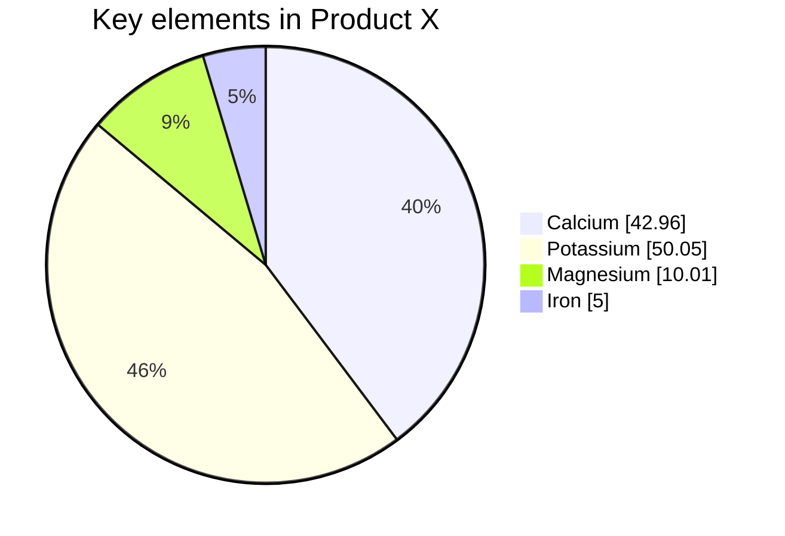

VGDevs is built on Docusaurus which supports **[Markdown](https://daringfireball.net/projects/markdown/syntax)** and a few **additional features**.

## Front Matter

Markdown documents have metadata at the top called [Front Matter](https://jekyllrb.com/docs/front-matter/):

```text title="my-doc.md"
// highlight-start
---
id: my-doc-id
title: My document title
description: My document description
slug: /my-custom-url
---
// highlight-end

## Markdown heading

Markdown text with [links](./hello.md)
```

## Links

Regular Markdown links are supported, using url paths or relative file paths.

```md
Let's see how to [Create a Tutorial](/create-a-tutorial).
```

```md
Let's see how to [Create a Tutorial](./create-a-tutorial.md).
```

**Result:** Let's see how to [Create a Tutorial](./create-a-tutorial).

## Images

Regular Markdown images are supported.

You can use absolute paths to reference images in the static directory (`static/img/docusaurus.png`):

```md

```


## Code Blocks

Markdown code blocks are supported with Syntax highlighting.

    ```jsx title="src/components/HelloDocusaurus.js"
    function HelloDocusaurus() {
        return (
            // highlight-next-lin e
            <h1>Hello, Docusaurus!</h1>
        )
    }
    ```

```jsx title="src/components/HelloDocusaurus.js"
function HelloDocusaurus() {
  // highlight-next-line
  return <h1>Hello, Docusaurus!</h1>;
}
```

---

Or even customize your codeblock with error messages with just 1 comment

// code-block-error-line

// highlight-next-line


    ```csharp title="MyCustomComponent.cs"
    public void MyCustomComponent() {
      CustomClass myClass = null;
      // code-block-error-lin e
      myClass.CustomMethod(false);
    }
    ```

```csharp title="MyCustomComponent.cs"
public void MyCustomComponent() {
  CustomClass myClass = null;
  // code-block-error-line
  myClass.CustomMethod(false);
}
```


## Admonitions

Docusaurus has a special syntax to create admonitions and callouts:

    :::tip My tip

    Use this awesome feature option

    :::

    :::danger Take care

    This action is dangerous

    :::

:::tip My tip

Use this awesome feature option

:::

:::danger Take care

This action is dangerous

:::

## MDX and React Components

[MDX](https://mdxjs.com/) can make your documentation more **interactive** and allows using any **React components inside Markdown**:

```jsx
export const Highlight = ({children, color}) => (
  <span
    style={{
      backgroundColor: color,
      borderRadius: '20px',
      color: '#fff',
      padding: '10px',
      cursor: 'pointer',
    }}
    onClick={() => {
      alert(`You clicked the color ${color} with label ${children}`)
    }}>
    {children}
  </span>
);

This is <Highlight color="#25c2a0">Docusaurus green</Highlight> !

This is <Highlight color="#1877F2">Facebook blue</Highlight> !
```

export const Highlight = ({children, color}) => (
  <span
    style={{
      backgroundColor: color,
      borderRadius: '20px',
      color: '#fff',
      padding: '10px',
      cursor: 'pointer',
    }}
    onClick={() => {
      alert(`You clicked the color ${color} with label ${children}`);
    }}>
    {children}
  </span>
);

This is <Highlight color="#25c2a0">Docusaurus green</Highlight> !

This is <Highlight color="#1877F2">Facebook blue</Highlight> !

## Diagrams

Using [Mermaid-js](https://mermaid-js.github.io/) you could make all kind of diagrams, pie charts, flowcharts and more.

    ```mermaid
    pie showData
        title Key elements in Product X
        "Calcium" : 42.96
        "Potassium" : 50.05
        "Magnesium" : 10.01
        "Iron" :  5
    ```




    ```mermaid
    graph TD;
      A-->B;
      A-->C;
      B-->D;
      C-->D;
    ```
    


## And more

Check the official [Docusaurus Markdown Features](https://docusaurus.io/docs/markdown-features).