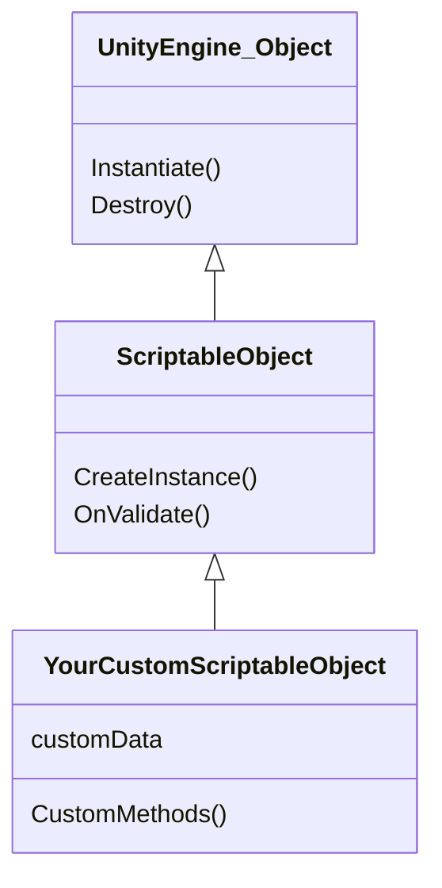

### What is an ScriptableObject

### What can I do with it

### Unity's Explanation

Check the official explanation in the [Unity Docs Site](https://docs.unity3d.com/Manual/class-ScriptableObject.html)

### Diagram

