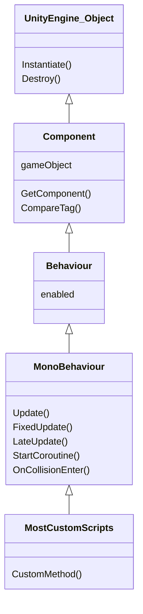

### The MonoBehaviour

### Diagram

```mermaid
classDiagram
    UnityEngine_Object <|-- Component
    UnityEngine_Object: Instantiate()
    UnityEngine_Object: Destroy()
    Behaviour <|-- MonoBehaviour
    MonoBehaviour <|-- MostCustomScripts
    Component <|-- Behaviour
    class Component {
        gameObject
        GetComponent<T>()
        CompareTag()
    }
    class Behaviour {
        enabled
    }
    class MonoBehaviour{
        Update()
        FixedUpdate()
        LateUpdate()
        StartCoroutine()
        OnCollisionEnter()
    }
    class MostCustomScripts {
        CustomMethod()
    }
```