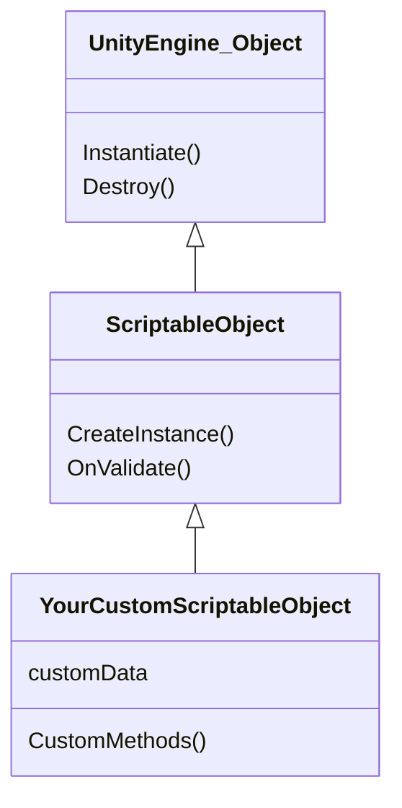

### The ScriptableObject aka SO

In object oriented programming ***Design Patterns*** are a really good and “standardized” way to handle code in an smart way, basically they are established solutions for commonly appearing problems every developer will encounter at some point in their career.

Now, as a game developer I’d emphasize (or start) on the following

- **Observer Pattern:** helpful for things like Events systems, example *OnPlayerDeath*, *OnEnemySpawn*, *OnDamage*, etc.
- **Strategy Pattern**: helpful for *Skills*, *Spells* or *Item* definition and more.
- **State Pattern**: helpful for simple AI, like when you need to change behaviours for an NPC while its *Idle* ****or *InCombat*.
- **Singleton Pattern**: now, careful with this one, I’ve seen quite the overuse of this in game dev. but its useful for when you need unique/single things existing in a game like some script manager for audio, game settings or the UI.

If you’re using Unity, **[Infallible Code](https://www.youtube.com/c/InfallibleCode)** has a really nice introduction to these.

> *Don’t take this as rules, keep them in mind, read about them but critique what are you doing, don’t overengineer shit that doesn’t need to be that complex.
- Me.*
> 

---

### Curated Books

- **[Design Patterns: Elements of Reusable Object-Oriented Software](https://read.amazon.com/kp/embed?asin=B000SEIBB8&preview=newtab&linkCode=kpe&ref_=cm_sw_r_kb_dp_AMZ5PCEXA9QXQHNNNVCG&tag=vgdevs-20)**
- **[Head First Design Patterns](https://read.amazon.com/kp/embed?asin=B08P3X99QP&preview=newtab&linkCode=kpe&ref_=cm_sw_r_kb_dp_BB0SH5WCGTY1JZH8K53J&tag=vgdevs-20)**

---

### Curated Videos

**[Infallible Code](https://www.youtube.com/c/InfallibleCode)**

**[Christopher Okhravi](https://www.youtube.com/c/ChristopherOkhravi)**

---

**[Tarodev](https://www.youtube.com/c/Tarodev)**

[**Jason Weimann](https://www.youtube.com/c/Unity3dCollege)** 

### Unity's Explanation

Check the official explanation in the [Unity Docs Site](https://docs.unity3d.com/Manual/class-ScriptableObject.html)

### Diagram

