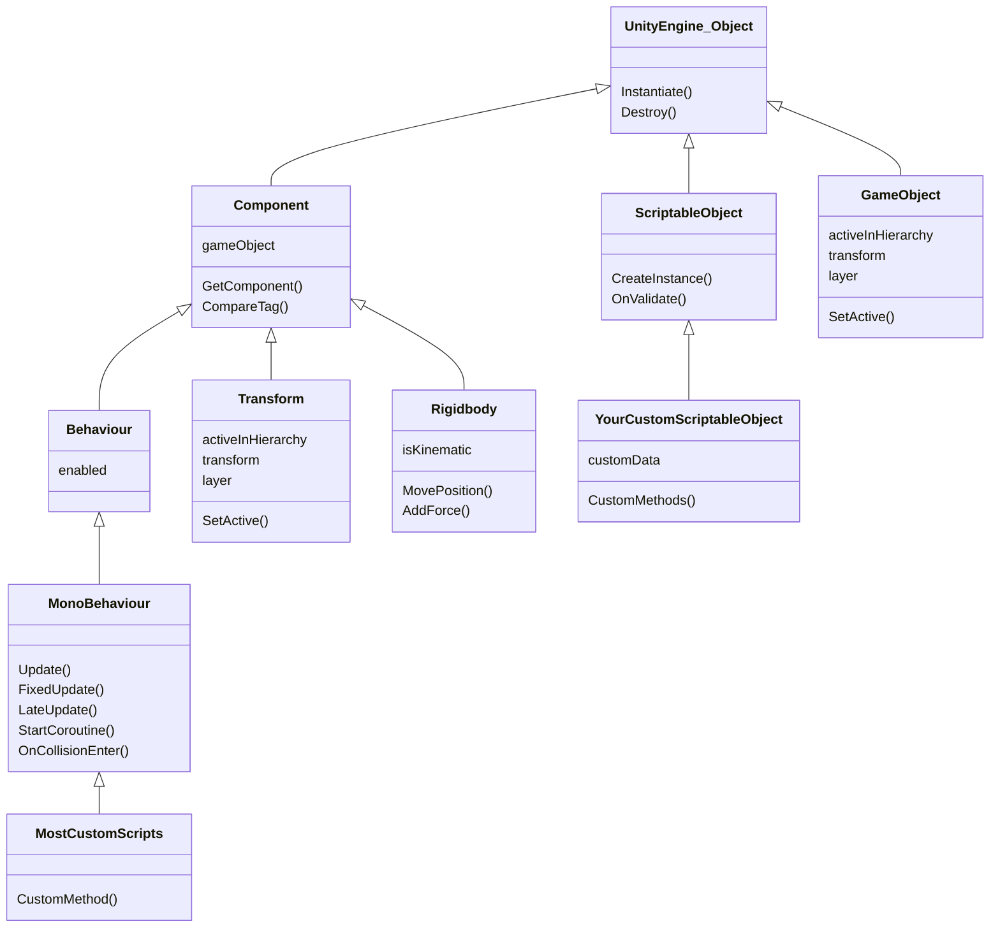

### The UnityEngine.Object

### The Component

### The GameObject

### The Transform

### The ScriptableObject

### Diagram

```mermaid
classDiagram
    UnityEngine_Object <|-- Component
    UnityEngine_Object <|-- ScriptableObject
    UnityEngine_Object <|-- GameObject
    UnityEngine_Object: Instantiate()
    UnityEngine_Object: Destroy()
    Behaviour <|-- MonoBehaviour
    MonoBehaviour <|-- MostCustomScripts
    Component <|-- Transform
    Component <|-- Rigidbody
    Component <|-- Behaviour
    ScriptableObject <|-- YourCustomScriptableObject
    class Component {
        gameObject
        GetComponent<T>()
        CompareTag()
    }
    class Rigidbody {
        isKinematic
        MovePosition()
        AddForce()
    }
    class ScriptableObject {
        CreateInstance()
        OnValidate()
    }
    class GameObject {
        activeInHierarchy
        transform
        layer
        SetActive()
    }
    class Transform {
        activeInHierarchy
        transform
        layer
        SetActive()
    }
    class Behaviour {
        enabled
    }
    class MonoBehaviour{
        Update()
        FixedUpdate()
        LateUpdate()
        StartCoroutine()
        OnCollisionEnter()
    }
    class MostCustomScripts {
        CustomMethod()
    }
    class YourCustomScriptableObject {
        customData
        CustomMethods()
    }
```